# Design notes

Screenshots of every key screen, with the reasoning behind each one. The system these
screens are built from — type scale, palette, spacing, component states — is documented in
the [Design system](../README.md#design-system) section of the main README.

All screenshots are of the running application at 1440 px wide, captured from the
production build against the seed data.

---

## Dashboard

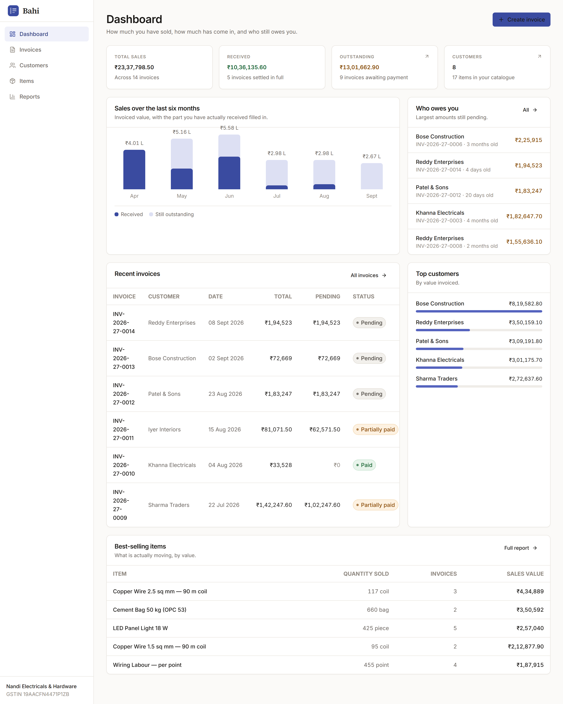

The first screen a business owner sees, and the one that has to answer two questions before
they read anything: **how are sales going**, and **who owes me money**.

- Four tiles, in the order the questions get asked: sold → received → outstanding →
  who I sell to. Outstanding is the only figure in amber, because it is the only one that
  needs action.
- The six-month chart shows invoiced value with the received portion filled in, so the gap
  between the two bars *is* the money still out. One chart, two facts, no legend-hunting.
- **Who owes you** is ordered by amount, not by date, and each row carries the age of the
  debt. A shop owner chasing payments starts at the top and works down.
- Large figures use lakh/crore shorthand (₹23.4 L) in tiles where the exact paisa does not
  help, and full Indian grouping (₹23,37,798.50) everywhere a number is being checked.

## Invoice creation

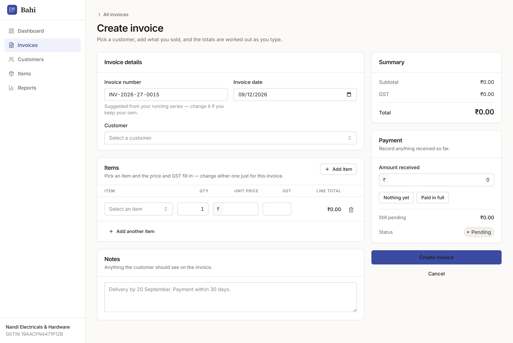

The most complex flow in the product, so it gets the most restraint.

- The invoice number is pre-filled from the running series and explained in one line, so
  the common case is zero typing and the uncommon case (their own numbering) is still open.
- Picking an item fills in its price and GST, but both stay editable **for this invoice
  only** — the real-world case of a negotiated price on one job, without corrupting the
  catalogue.
- The summary panel is sticky and always visible. Subtotal, GST and total are recomputed on
  every keystroke, in the browser, from the same money algorithm the server uses.
- "Nothing yet" and "Paid in full" cover the two payments a small business actually records
  at invoice time; the free-text box covers the rest.

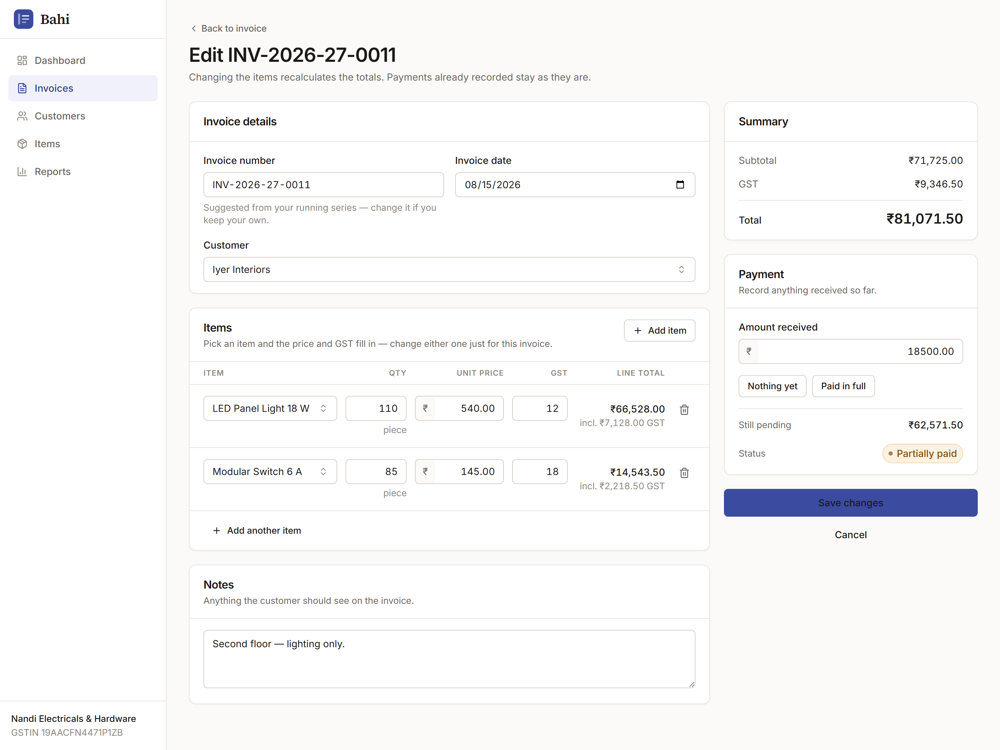

The same form carrying real lines. Each line shows its own GST underneath the total, so a
mixed-rate invoice (12 % lighting, 18 % switchgear) is legible without opening a calculator.
The status chip in the summary previews what the invoice will become once saved.

## Invoice detail

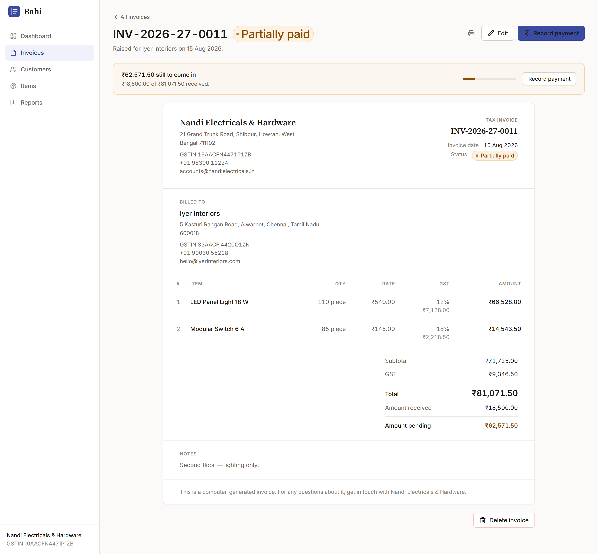

A document, not a screen. This is the view a business owner would turn around and show to
the customer, so the application chrome stops at the top and everything below is the
invoice itself — serif headings, generous margins, no navigation.

- The payment banner above the document is the one piece of app UI that stays, because
  "₹62,571.50 still to come in" is what the owner is here for.
- Per-line GST is printed under each line amount, with subtotal / GST / total / received /
  pending stacked in the order an accountant reads them.
- The print stylesheet hides the sidebar, banner and buttons, so **Print → Save as PDF**
  produces the document alone, on A4, with no extra work.

## Lists

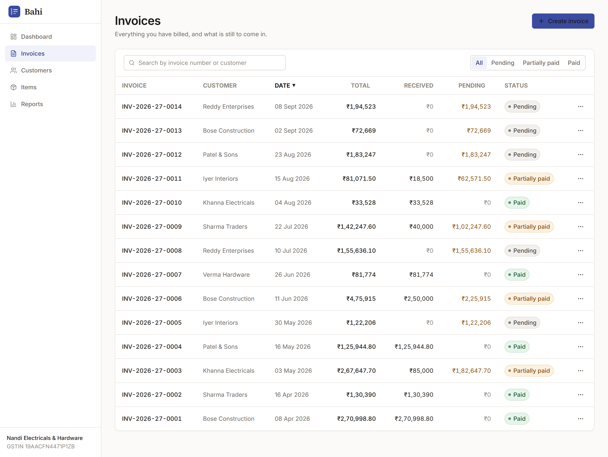

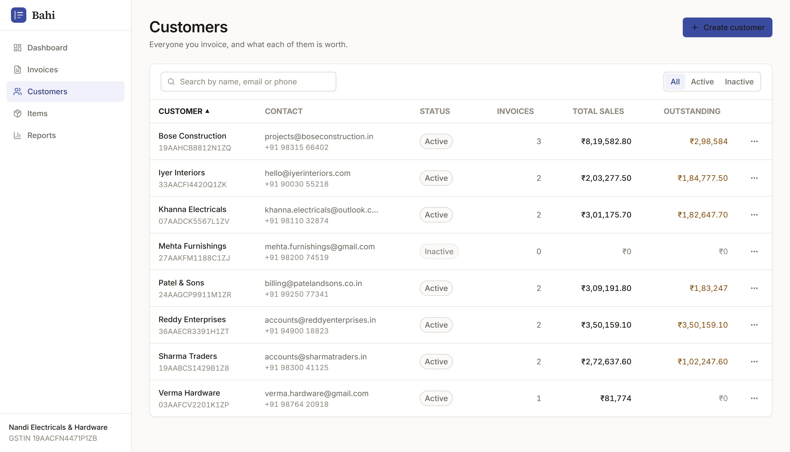

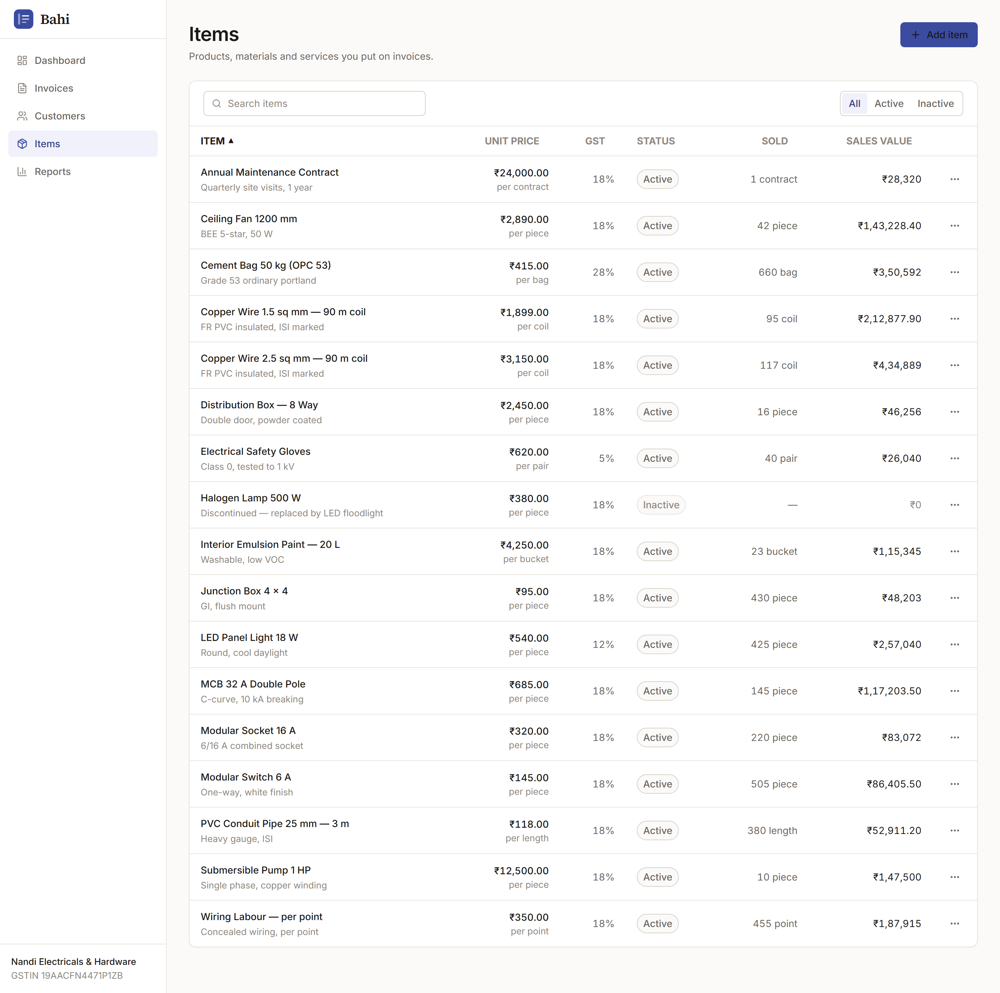

Data-dense tables, treated as the product's real workhorse.

- Every rupee figure is right-aligned and set in tabular figures, so columns line up
  digit-for-digit and a long column can be scanned for magnitude alone.
- Text columns stay left-aligned. Descriptions truncate at a sensible width rather than
  wrapping and breaking row rhythm.
- Zero amounts are muted, so a column of pending figures shows only what is actually owed.
- Status chips are the only colour in the table. Pending is deliberately a warm neutral,
  not red — an unpaid invoice raised this morning is not an error, and colouring it red
  teaches people to ignore red.
- Filters and search sit in one toolbar above the table and drive the API, not a
  client-side filter, so they keep working as the data grows.

## Detail views

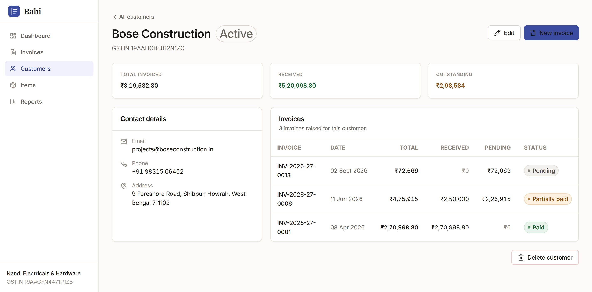

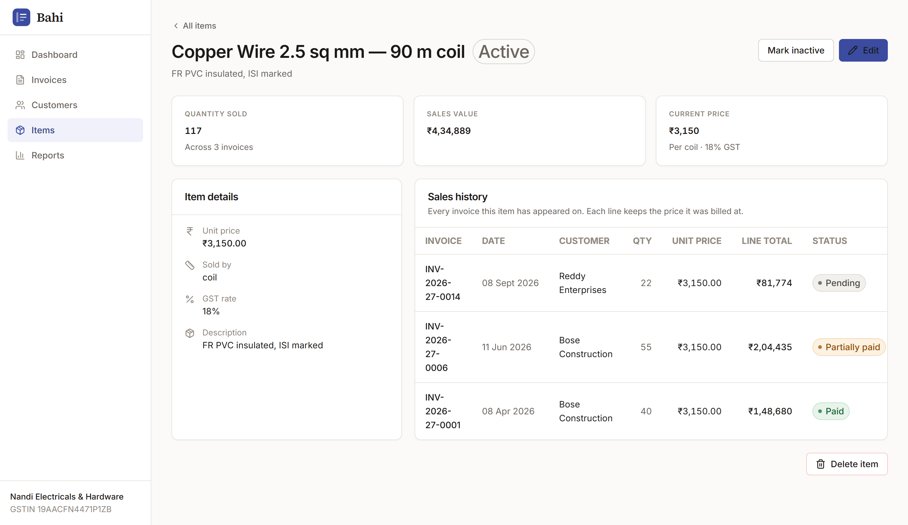

Both detail screens answer "what is this record worth to me?" before showing its fields.

- The customer view leads with invoiced / received / outstanding, then contact details,
  then the full invoice history — a transaction ledger for that customer.
- The item view leads with quantity sold and sales value, then the catalogue fields, then
  every invoice the item has appeared on. Each history line keeps the price it was billed
  at, which is what makes the snapshot design visible to the user rather than just correct
  in the database.
- Destructive actions sit at the bottom, away from everything else, and explain the
  consequence before asking.

## Reports

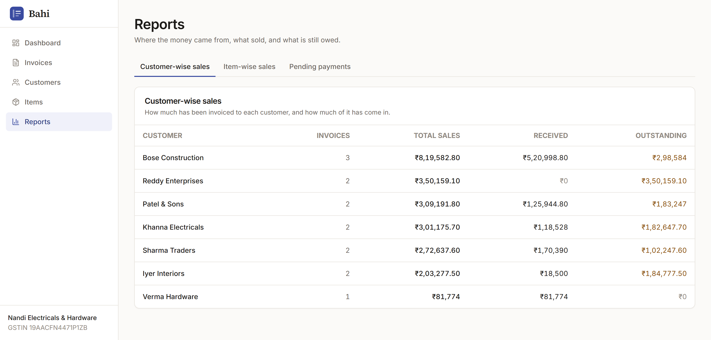

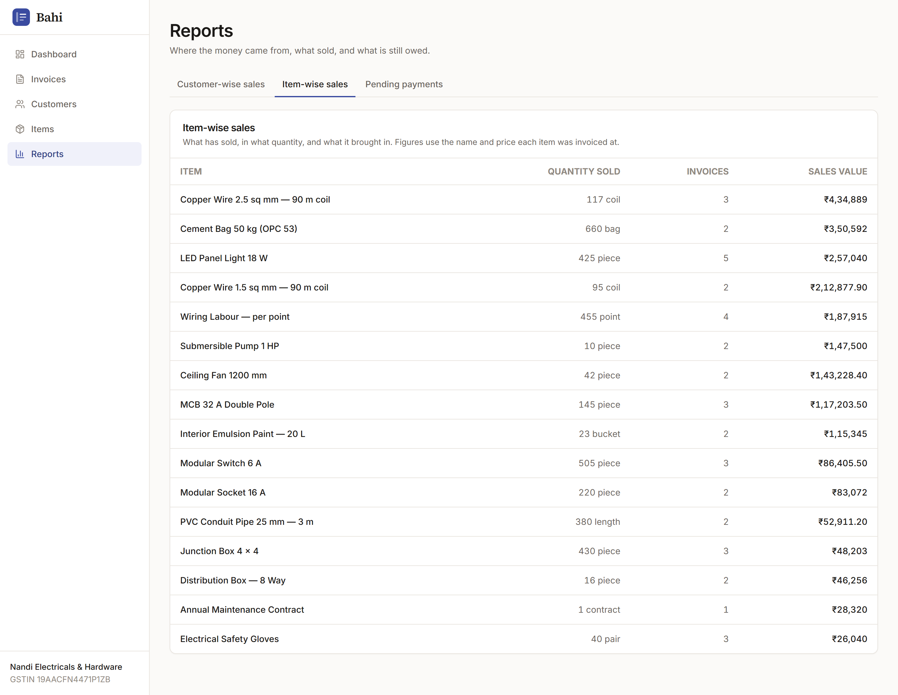

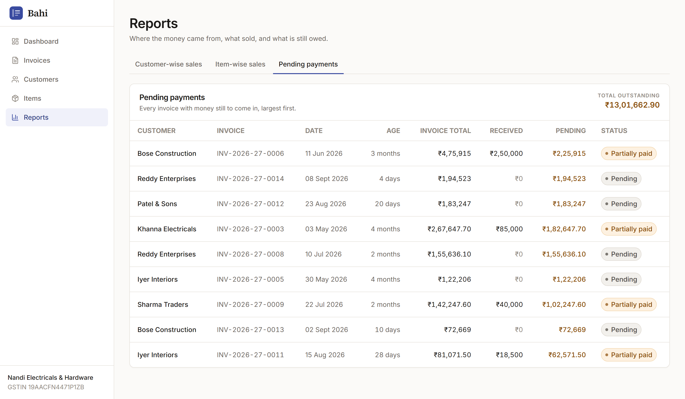

Three questions, three tabs, one URL each (`/reports?view=pending` is linkable, so the
dashboard's Outstanding tile can point straight at it).

- **Customer-wise sales** — invoiced, received and outstanding per customer, sorted by
  value, because the question is always "who are my biggest customers". A customer who has
  paid in full shows a muted ₹0 rather than a loud zero, so the outstanding column reads as
  a list of who to chase.
- **Item-wise sales** — quantity sold and sales value per item, so a shop can see what
  actually moves.
- **Pending payments** — the collections worklist: customer, invoice, date, age, total,
  received, pending, status. Age is the column that is not in the brief and earns its
  place; "4 months old" is what turns a number into a phone call.

## States

Every table and card handles four states, not one:

- **Loading** — a shimmer skeleton that keeps the table's shape, so the layout does not
  jump when data lands.
- **Error** — a plain sentence and a Retry button, never a stack trace.
- **Empty (no data yet)** — names the next action: *"No customers yet — add your first
  customer to start creating invoices."*
- **Empty (filtered to nothing)** — a different message, with a Clear filters button,
  because "no results for this search" and "you have not added anything" are different
  problems.

Microcopy throughout is written for a shop owner rather than a developer. Errors say
*"Please select a customer."*, not `customer_id is required`. Confirmations describe the
consequence — *"sales figures will change"* — instead of asking "Are you sure?".
